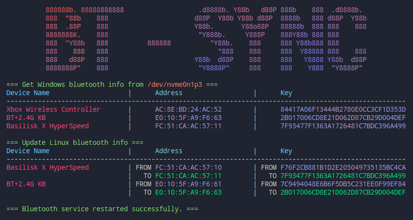

# bt-sync

## Introduction
`bt-sync` is a tool designed to synchronize Bluetooth device information, particularly long-term keys (LTK), between Windows and Linux systems. It extracts Bluetooth device information from the Windows registry and applies it to the Linux Bluetooth configuration files. This process includes updating the LTK in the Linux configuration files and restarting the Bluetooth service if necessary.

## Features
- Cross-platform Sync: Extracts Bluetooth device information from the Windows registry and syncs it to the Linux system.
- Automatic NTFS Partition Mounting: Automatically finds and mounts NTFS partitions containing the Windows system to access registry files.
- Bluetooth Device Handling: Updates Bluetooth device configuration files located in /var/lib/bluetooth/ to ensure LTK consistency.

## Screenshot


## Usage
### Configuring Bluetooth Devices
Before synchronizing Bluetooth device information, ensure that you have paired the Bluetooth - devices on both Linux and Windows systems to save the latest device information.

1. Pairing Bluetooth Devices on Linux
    - Open your Linux system and ensure the Bluetooth service is running.
    - Pair the Bluetooth device using a management tool like bluetoothctl or the graphical interface provided by your desktop environment.
    - After pairing, ensure the device is connected and note down its name and MAC address.

1. Pairing Bluetooth Devices on Windows
    - Boot into the Windows system and open "Settings" -> "Devices" -> "Bluetooth & other devices".
    - Follow the wizard to pair with the same Bluetooth device.
    - Ensure the paired device in Windows matches the one paired on Linux.

1. Return to Linux and Execute Sync
    - Reboot or switch back to your Linux system.
    - Ensure the NTFS partition containing the Windows registry files is accessible (not encrypted and readable).
    - Navigate to the directory containing the bt-sync tool and execute the following command to start the synchronization process:
        ```bash
        sudo ./bt-sync
        ```

1. The program will automatically locate and mount any unmounted NTFS partitions, parse the Windows registry files, extract Bluetooth device information (including LTKs), and update these details to the Linux Bluetooth configuration files.
1. Finally, it will restart the Bluetooth service to apply the new configurations.

## Precautions
 - Ensure you have sufficient permissions to access and modify Bluetooth configuration files and mount NTFS partitions.
 - It's recommended to back up important Bluetooth configuration files before starting.
 - If there are no NTFS partitions on your system or the registry files are unavailable, the tool will skip extracting information from Windows and may report that no LTK was found.
 - The tool only processes Bluetooth device configuration files in the /var/lib/bluetooth/ directory, so make sure your Linux system uses the default path.

## Contributing
Contributions are welcome! If you have any questions, suggestions, or want to contribute to the project, feel free to submit an issue or pull request.

1. Fork this repository.
1. Create a new branch (git checkout -b feature/new-feature).
1. Make necessary changes or add new features.
1. Commit changes (git commit -am 'Add some new feature').
1. Push changes to your forked branch (git push origin feature/new-feature).
1. Submit a Pull Request on the original repository.

## License
This project is licensed under the MIT License. See the LICENSE file for details.

